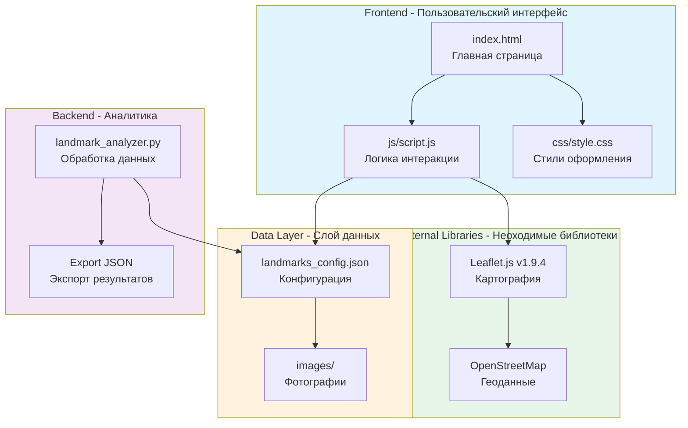
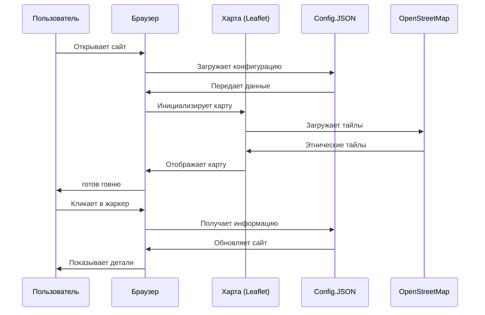
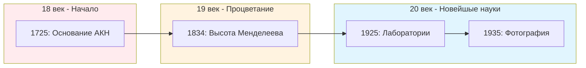
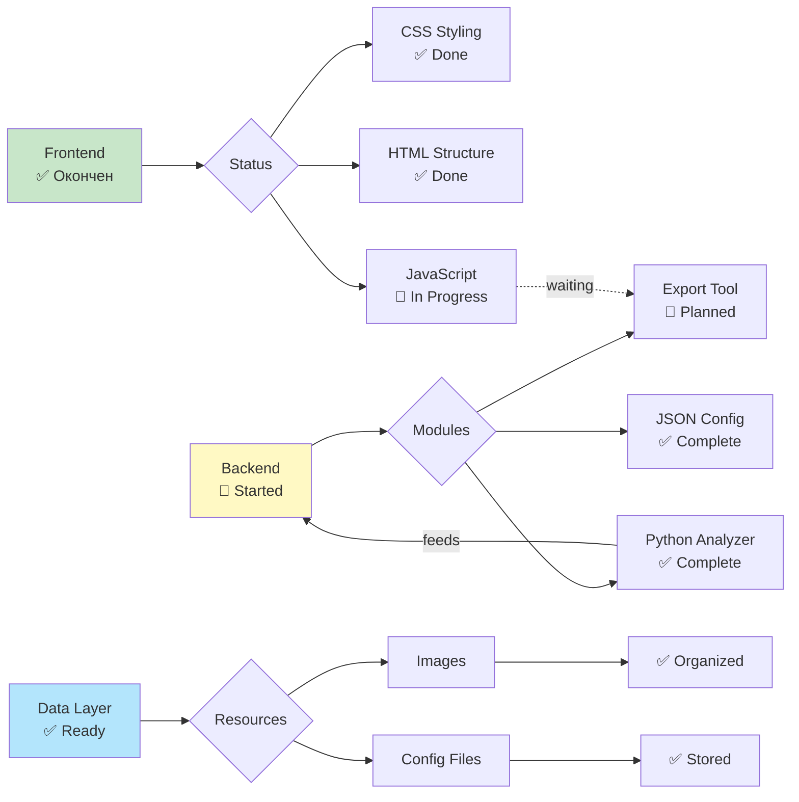
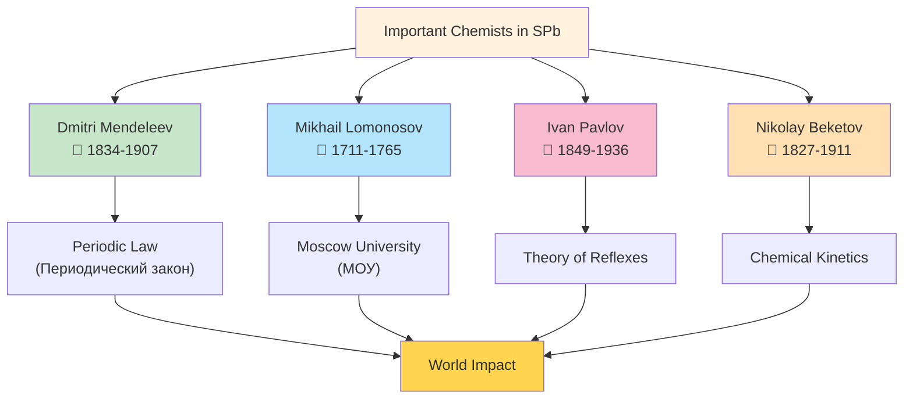

# Архитектура проекта Науковые Ландмарки

Сей файл осыстематизирует техническую архитектуру и арои данных проекта.

## Структура проекта

## Поток данных в системе

## Типы достопримечательностей и история

## Статус модулей и компонентов

## Нирамида Менделеева и выдающиеся химики

---

## Ключевые показатели

- **Frontend**: HTML5 + CSS3 + Vanilla JS
- **Mapping**: Leaflet.js v1.9.4 + OpenStreetMap
- **Data**: JSON Configuration + Python Analysis
- **Analytics**: Python Script for Data Validation
- **Status**: 75% Complete

*Обновлено: Декабрь 2025*
