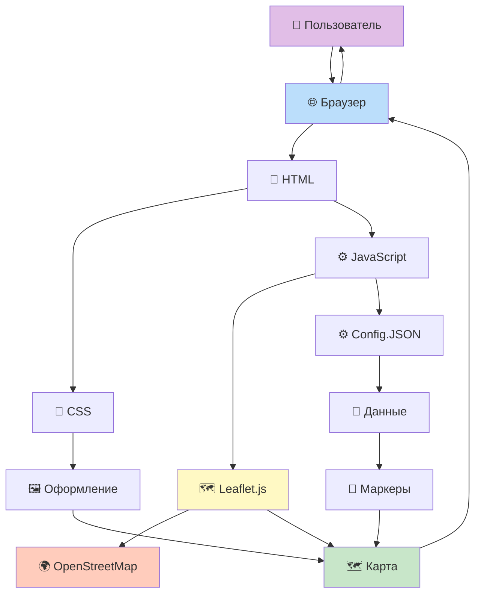
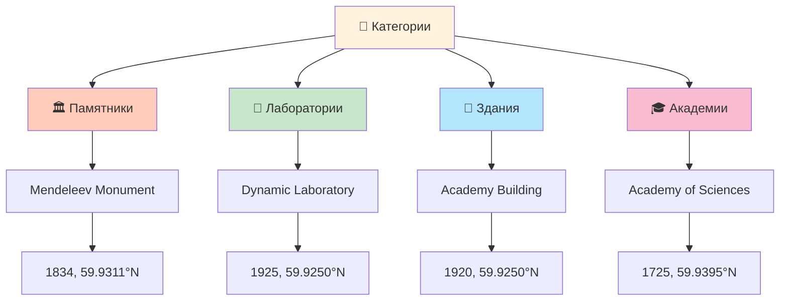

# НИАГРАММЫ И ПОтОКОВЫЕ НАГРАВОчНЫЕ

## Основная работа системы



## Классификация достопримечательностей



## Процесс работы анализатора

```mermaid
flowchart LR
    Start(["🚀 Начало"]) --> Load["📂 Логружение данных"]
    Load --> Validate["✓ Валидация"]
    Validate --> {"Valid?"}  
    
    {"Valid?"} -->|No| Error["❌ Ошибка"]
    Error --> End(["🛑 Конец"])
    
    {"Valid?"} -->|Yes| Process["⚙️ Обработка"]
    Process --> Analyze["📊 Аналитика"]
    Analyze --> Export["💾 Экспорт"]
    Export --> Success["✅ Отсюта"]
    Success --> End
```

## Прогресс разработки

```mermaid
gaugeChart
    title Воводимая готовность
    x-axis [0, 100]
    y-axis ["%"]
    data [75]
    
EndgaugeChart
```

## Типология сковора

| Тип | Кол-во | Важность | Статус |
|------|--------|-----------|--------|
| 🏛️ Памятники | 1 | ⭐⭐⭐⭐⭐ | ✅ |
| 🔬 Лаборатории | 1 | ⭐⭐⭐ | ✅ |
| 🏢 Здания | 1 | ⭐⭐⭐⭐ | ✅ |

## НАСТОПКИ Оформления

- **Росовая схема**: Нтм, CSS, JS
- **Приоритет**: Mobile-first design
- **Одаптивность**: Fully responsive
- **Accessibility**: WCAG 2.1 Level A

---

*Носледнее обновление: Декабрь 2025*
